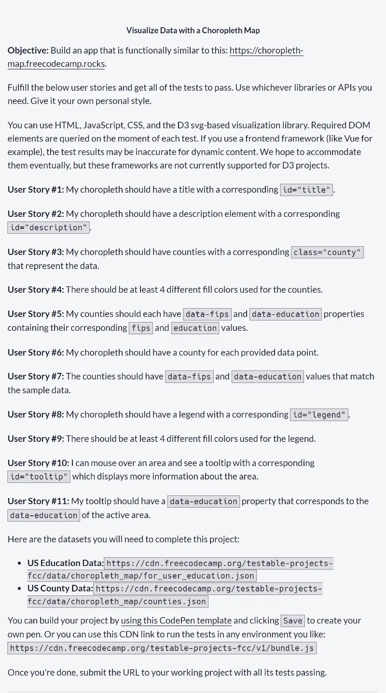
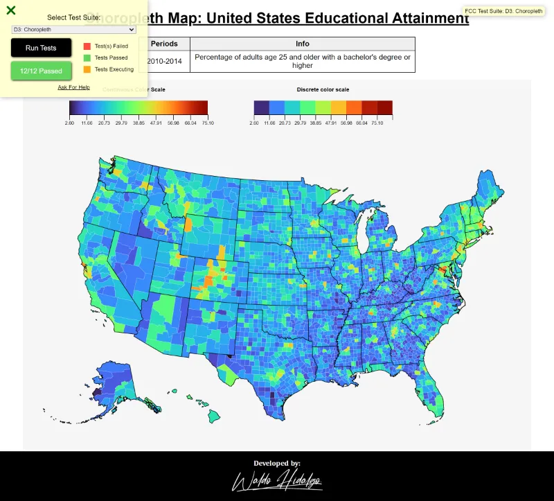
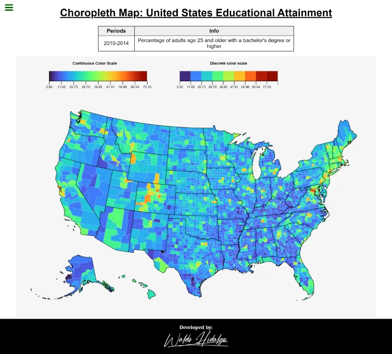
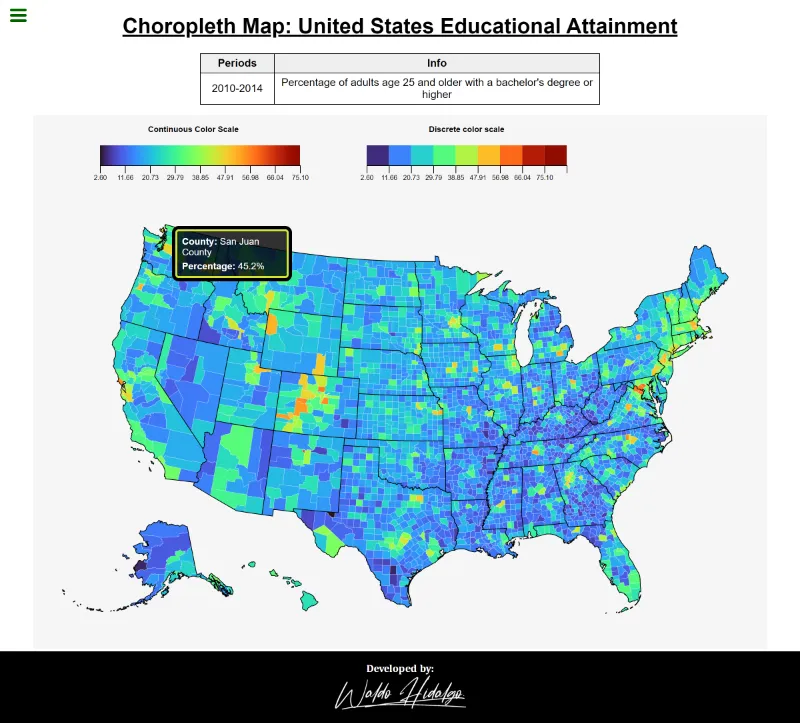
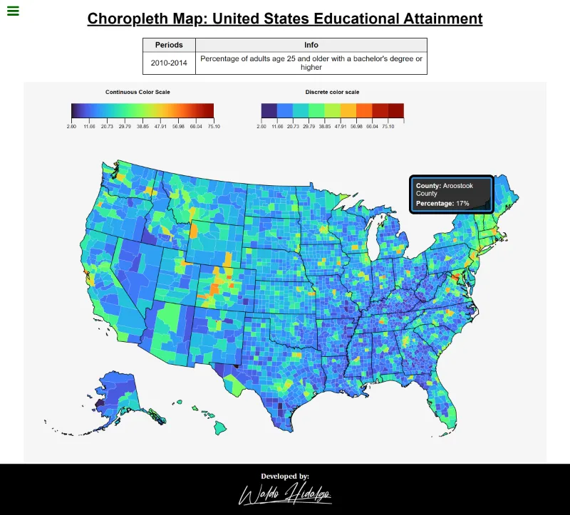
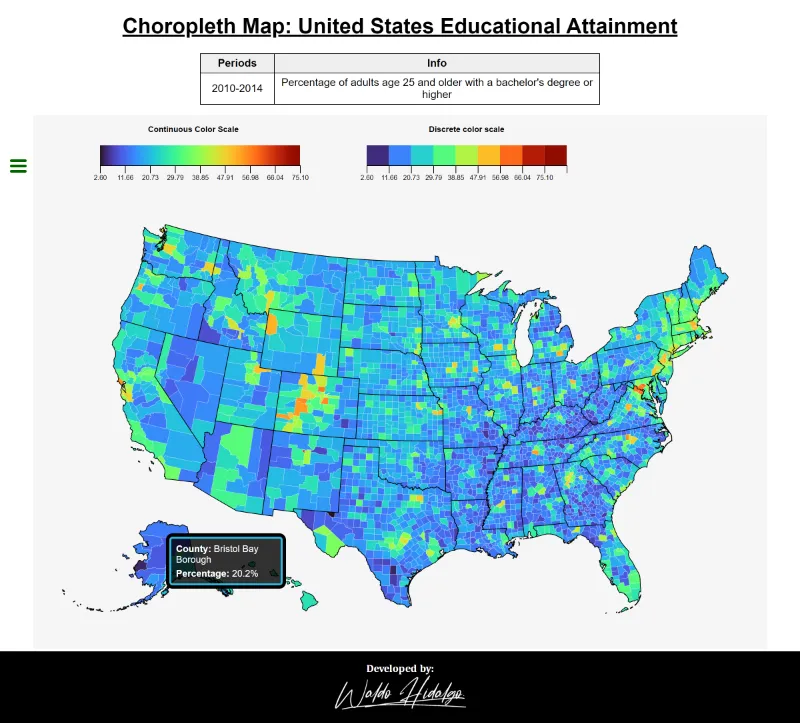
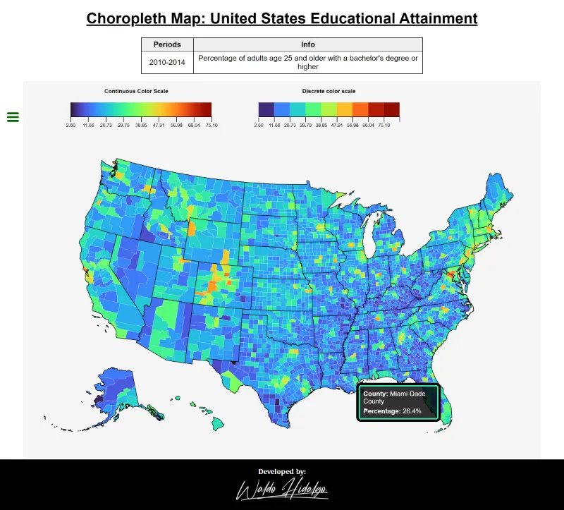

# Choropleth Map: United States Educational Attainment

[Cuarto proyecto](https://www.freecodecamp.org/learn/data-visualization/data-visualization-projects/visualize-data-with-a-choropleth-map) requisito obligatorio para obtener la **Data Visualization Certification** de freecodecamp.

## Tabla de Contenidos

## Requisitos

## All Tests Passed

## Screenshots

### 1. Home

### 2. Tooltips

Todos los tooltips se muestran dentro del gráfico:

#### 2.1. Tooltip Upper Left

#### 2.2. Tooltip Upper Right

#### 2.3. Tooltip Upper Right

#### 2.4. Tooltip Bottom Right

